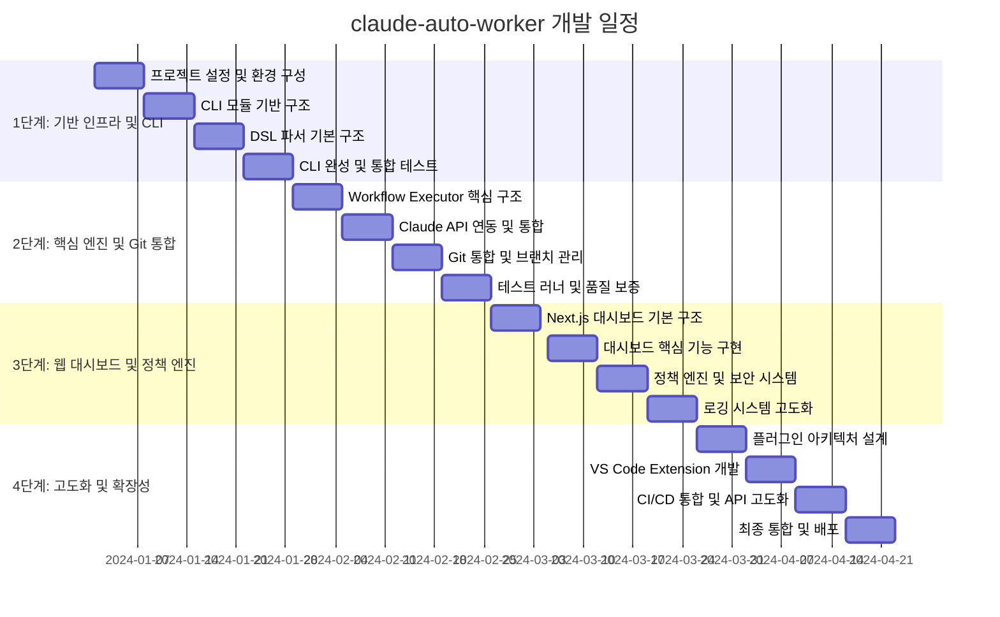

# 📊 PROJECT_STATUS.md - claude-auto-worker

## 🎯 프로젝트 개요 및 현재 상황

### 프로젝트 정보
- **프로젝트명**: claude-auto-worker
- **목표**: 차세대 Claude Code 자동화 도구 개발
- **현재 상태**: 스프린트 2 진행 중 (핵심 엔진 MVP 완료)
- **MVP 목표**: CLI + 웹 대시보드 기반 자동화 엔진
- **기술 스택**: NestJS + TypeScript + Next.js

### 현재 상황 요약
- ✅ PRD (Product Requirements Document) 완성
- ✅ TRD (Technical Requirements Document) 완성
- ✅ 아키텍처 설계 및 기술 스택 결정
- 🔄 개발 환경 설정 및 프로젝트 초기화 진행 중
- ⏳ 첫 번째 개발 스프린트 준비 중
  - ✅ TASK-001 완료: 프로젝트 초기화 및 디렉토리 구조 설정
  - ✅ TASK-002 완료: NestJS 프로젝트 생성 및 기본 설정
  - ✅ TASK-008 완료: NestJS Commander 모듈 통합 (CLI 기본 명령어 등록)
  - ✅ TASK-009 완료: CLI 명령어 기본 구조 설계
  - ✅ TASK-010 완료: 설정 파일 관리 시스템 구현
  - ✅ TASK-011 완료: CLI 에러 핸들링 및 사용자 피드백 시스템
  - ✅ TASK-012 완료: CLI 테스트 환경 구성 (Jest 설정, 테스트 커버리지, 모킹)
  - ✅ TASK-013 완료: CLI 문서화 및 사용자 가이드
  - ✅ TASK-014 완료: YAML/JSON 파서 기본 구조 구현 (CLI 통합, 테스트 45/45 통과)
  - ✅ TASK-015 완료: 워크플로우 스키마 검증 시스템 (Ajv 기반, 커스텀 uniqueStepIds 포함)
  - ✅ TASK-016 완료: DSL 문법 파싱 엔진 개발 (stages, prompt, run 파싱, Handlebars 템플릿 지원)
  - ✅ PR #9 머지: `DEVELOPMENT_TASKS.md`에 "프로토타입 Fast-Track" 섹션 추가 (데모 최단 경로 정리)
  - ✅ PR #10 머지: 파서 통합 및 CLI 테스트 안정화
  - ✅ PR #13 머지: Workflow Executor MVP (TASK-020) 완료
  - ✅ PR #21 머지: Executor – Claude CLI 액션 매핑/실행 및 로깅 (TASK-081)
  - ✅ PR #22 머지: CLI logs/status 정비 - runId 기반 상태 추정 고도화 (TASK-083)

### 핵심 가치 제안
1. **안전한 자동화**: Git 브랜치 격리, 테스트 자동화, 정책 기반 필터링
2. **개발자 친화적**: DSL 기반 워크플로우, CLI 우선 설계
3. **확장 가능**: 플러그인 아키텍처, API 기반 통합
4. **에디터 독립**: VS Code 종속성 없는 독립 실행 환경

---

## 🗓️ 4단계 개발 로드맵 (주차별 상세 계획)

### 🚀 1단계: 기반 인프라 및 CLI (1-4주)
**목표**: 프로젝트 기반 구조 구축 및 CLI 모듈 개발

#### 1주차: 프로젝트 설정 및 환경 구성
- 프로젝트 초기화 및 디렉토리 구조 설정
- NestJS 프로젝트 생성 및 기본 설정
- TypeScript 설정 및 ESLint/Prettier 구성
- 개발 환경 Docker 컨테이너 설정
- CI/CD 파이프라인 기본 구조 구축

#### 2주차: CLI 모듈 기반 구조
- NestJS Commander 모듈 통합
- CLI 명령어 기본 구조 설계
- 설정 파일 관리 시스템 구현
- 로깅 시스템 기본 구조 구축
- ✅ 에러 핸들링 및 사용자 피드백 시스템

#### 3주차: DSL 파서 기본 구조
- YAML/JSON 파서 기본 구조 구현 ✅ (PR #10)
- 워크플로우 스키마 검증 시스템 ✅ (PR #11)
- DSL 문법 파싱 엔진 개발 ✅ (PR #12)
- 설정 파일 템플릿 시스템 구축
- 파서 단위 테스트 작성 ✅ (PR #12)

#### 4주차: CLI 완성 및 통합 테스트
- CLI 명령어 완성 (run, status, logs)
- 워크플로우 실행 기본 프레임워크
- 통합 테스트 및 E2E 테스트 작성
- ✅ CLI 문서화 및 사용자 가이드 작성
- 1단계 완료 검증 및 2단계 준비

### 🔧 2단계: 핵심 엔진 및 Git 통합 (5-8주)
**목표**: 워크플로우 실행 엔진 및 Git 통합 기능 개발

#### 5주차: Workflow Executor 핵심 구조
- 워크플로우 실행 엔진 설계 및 구현
- 단계별 실행 관리 시스템
- 작업 큐 및 스케줄링 시스템
- 실행 상태 관리 및 모니터링
- 에러 처리 및 복구 메커니즘

#### 6주차: Claude API 연동 및 통합
- Claude API 클라이언트 구현
- API 키 관리 및 보안 설정
- Usage limit 감지 및 자동 재시도 시스템
- 응답 처리 및 파싱 시스템
- API 호출 로깅 및 모니터링

#### 7주차: Git 통합 및 브랜치 관리
- SimpleGit 라이브러리 통합
- 브랜치 격리 및 자동 생성 시스템
- 변경사항 자동 커밋 및 푸시
- Git 상태 모니터링 및 동기화
- Git 에러 처리 및 복구 시스템

#### 8주차: 테스트 러너 및 품질 보증
- 테스트 명령어 실행 시스템
- 테스트 결과 파싱 및 분석
- 실패 시 자동 롤백 시스템
- 테스트 로그 관리 및 저장
- 2단계 완료 검증 및 3단계 준비

### 🌐 3단계: 웹 대시보드 및 정책 엔진 (9-12주)
**목표**: 웹 기반 모니터링 시스템 및 보안 정책 엔진 구축

#### 9주차: Next.js 대시보드 기본 구조
- Next.js 14 프로젝트 생성 및 설정
- TailwindCSS 및 기본 UI 컴포넌트 구성
- 레이아웃 및 네비게이션 시스템 구축
- 반응형 디자인 및 테마 시스템
- 기본 페이지 구조 및 라우팅

#### 10주차: 대시보드 핵심 기능 구현
- 실시간 상태 모니터링 대시보드
- 워크플로우 실행 현황 시각화
- 로그 뷰어 및 검색 시스템
- 차트 및 그래프 컴포넌트 구현
- 실시간 업데이트 및 WebSocket 연동

#### 11주차: 정책 엔진 및 보안 시스템
- 정책 기반 필터링 시스템 구현
- 금지 명령어 및 경로 제한 시스템
- 변경 라인 수 제한 및 검증
- 보안 정책 설정 및 관리 UI
- 정책 위반 감지 및 알림 시스템

#### 12주차: 로깅 시스템 고도화
- Winston 기반 고급 로깅 시스템
- 구조화된 로그 및 검색 기능
- 로그 보관 및 아카이빙 시스템
- 성능 모니터링 및 메트릭 수집
- 3단계 완료 검증 및 4단계 준비

### 🚀 4단계: 고도화 및 확장성 (13-16주)
**목표**: 플러그인 시스템 및 VS Code Extension 개발

#### 13주차: 플러그인 아키텍처 설계
- 플러그인 시스템 아키텍처 설계
- 플러그인 인터페이스 및 API 정의
- 플러그인 개발 가이드 및 SDK 작성
- 기본 플러그인 예제 구현
- 플러그인 관리 및 배포 시스템

#### 14주차: VS Code Extension 개발
- VS Code Extension 프로젝트 생성
- 워크플로우 시각적 편집기 구현
- 큐 관리 및 모니터링 UI
- 설정 및 정책 관리 인터페이스
- Extension 테스트 및 검증

#### 15주차: CI/CD 통합 및 API 고도화
- REST API 고도화 및 문서화
- CI/CD 파이프라인 통합 API
- 외부 도구 연동 및 웹훅 시스템
- API 성능 최적화 및 캐싱
- API 보안 및 인증 시스템 강화

#### 16주차: 최종 통합 및 배포
- 전체 시스템 통합 테스트
- 성능 최적화 및 메모리 누수 방지
- 사용자 문서 및 가이드 완성
- 배포 패키지 및 Docker 이미지 생성
- 프로젝트 완료 및 출시 준비

---

## 🛠️ 기술 스택 상세 정보

### Backend & Core Engine
| 기술 | 버전 | 용도 | 대안 |
|------|------|------|------|
| **NestJS** | 10.x | 백엔드 프레임워크 | Express.js, Fastify |
| **TypeScript** | 5.x | 타입 안전성 및 개발 생산성 | JavaScript |
| **Node.js** | 18.x LTS | 런타임 환경 | Deno, Bun |
| **Prisma** | 5.x | 데이터베이스 ORM | TypeORM, Sequelize |

### CLI & Command Line
| 기술 | 버전 | 용도 | 대안 |
|------|------|------|------|
| **NestJS Commander** | 9.x | CLI 프레임워크 | Commander.js, Yargs |
| **js-yaml** | 4.x | YAML 파싱 | yaml, js-yaml |
| **ajv** | 8.x | JSON 스키마 검증 | Joi, Zod |

### Frontend & Dashboard
| 기술 | 버전 | 용도 | 대안 |
|------|------|------|------|
| **Next.js** | 14.x | React 프레임워크 | Vite, Create React App |
| **React** | 18.x | UI 라이브러리 | Vue.js, Svelte |
| **TailwindCSS** | 3.x | CSS 프레임워크 | Bootstrap, Material-UI |
| **Chart.js** | 4.x | 차트 및 시각화 | D3.js, Recharts |

### Database & Storage
| 기술 | 버전 | 용도 | 대안 |
|------|------|------|------|
| **SQLite** | 3.x | 임베디드 데이터베이스 | PostgreSQL, MySQL |
| **Winston** | 3.x | 로깅 시스템 | Pino, Bunyan |
| **fs-extra** | 11.x | 파일 시스템 확장 | Node.js fs, graceful-fs |

### Git & Version Control
| 기술 | 버전 | 용도 | 대안 |
|------|------|------|------|
| **simple-git** | 3.x | Git 작업 자동화 | nodegit, git-js |
| **Git** | 2.x | 버전 관리 | Mercurial, SVN |

### Testing & Quality
| 기술 | 버전 | 용도 | 대안 |
|------|------|------|------|
| **Jest** | 29.x | 테스트 프레임워크 | Vitest, Mocha |
| **Supertest** | 6.x | API 테스트 | Axios, Request |
| **ESLint** | 8.x | 코드 품질 검사 | TSLint, Prettier |
| **Prettier** | 3.x | 코드 포맷팅 | ESLint, EditorConfig |

### DevOps & Deployment
| 기술 | 버전 | 용도 | 대안 |
|------|------|------|------|
| **Docker** | 24.x | 컨테이너화 | Podman, LXC |
| **GitHub Actions** | - | CI/CD 파이프라인 | GitLab CI, Jenkins |
| **PM2** | 5.x | 프로세스 관리 | Forever, nodemon |

---

## 📅 간트 차트 포함 개발 일정

### 주요 마일스톤
- **Week 4**: CLI MVP 완성 및 기본 워크플로우 실행 가능
- **Week 8**: Git 통합 및 테스트 자동화 완성
- **Week 12**: 웹 대시보드 및 정책 엔진 완성
- **Week 16**: 전체 시스템 완성 및 출시 준비

---

## ⚠️ 주요 리스크 및 완화 방안

### 기술적 리스크

#### 1. Claude API 제한 및 안정성
- **리스크**: API 호출 제한, 응답 지연, 서비스 중단
- **완화 방안**: 
  - Usage limit 자동 감지 및 재시도 시스템
  - 요청 큐잉 및 백오프 전략
  - API 상태 모니터링 및 알림
  - 대체 AI 모델 지원 준비

#### 2. Git 작업 충돌 및 데이터 손실
- **리스크**: 브랜치 충돌, 커밋 실패, 데이터 손실
- **완화 방안**:
  - 브랜치 격리 및 자동 백업
  - 변경사항 검증 및 승인 시스템
  - 롤백 및 복구 메커니즘
  - Git 상태 모니터링 및 알림

#### 3. 메모리 누수 및 성능 저하
- **리스크**: 장시간 실행 시 메모리 누수, 성능 저하
- **완화 방안**:
  - 메모리 사용량 모니터링
  - 주기적 가비지 컬렉션
  - 리소스 사용량 제한
  - 성능 프로파일링 및 최적화

### 프로젝트 관리 리스크

#### 4. 일정 지연 및 범위 확장
- **리스크**: 개발 일정 지연, 기능 범위 확장
- **완화 방안**:
  - MVP 범위 명확화 및 고수
  - 주간 진행 상황 점검
  - 우선순위 기반 기능 개발
  - 스프린트별 완료 기준 설정

#### 5. 팀 역량 및 의존성
- **리스크**: 기술적 역량 부족, 외부 의존성 문제
- **완화 방안**:
  - 기술 스택 학습 및 교육 계획
  - 외부 라이브러리 대안 검토
  - 단계별 학습 및 적용
  - 지속적인 코드 리뷰 및 피드백

### 보안 및 운영 리스크

#### 6. API 키 노출 및 보안 취약점
- **리스크**: API 키 노출, 인증 우회, 데이터 유출
- **완화 방안**:
  - 환경변수 기반 보안 설정
  - API 키 암호화 및 마스킹
  - 접근 제어 및 권한 관리
  - 보안 정책 및 가이드라인 수립

#### 7. 사용자 데이터 및 개인정보
- **리스크**: 개인정보 유출, 데이터 보호 규정 위반
- **완화 방안**:
  - 데이터 암호화 및 익명화
  - 개인정보 처리 방침 수립
  - 데이터 보관 기간 및 삭제 정책
  - GDPR 및 개인정보보호법 준수

---

## 🚀 즉시 실행 액션 아이템

### 🔴 긴급 (이번 주 내)
1. **프로젝트 디렉토리 구조 생성**
   - `mkdir -p src/{cli,core,parser,git,test,dashboard}`
   - `mkdir -p docs/{api,user-guide,developer}`
   - `mkdir -p tests/{unit,integration,e2e}`

2. **NestJS 프로젝트 초기화**
   - `npm init -y`
   - `npm install @nestjs/core @nestjs/common @nestjs/cli`
   - `npm install -D typescript @types/node`

3. **기본 설정 파일 생성**
   - `tsconfig.json` 설정
   - `.eslintrc.js` 설정
   - `.prettierrc` 설정
   - `docker-compose.yml` 생성

### 🟡 중요 (다음 주 내)
4. **개발 환경 Docker 컨테이너 설정**
   - Node.js 개발 환경 컨테이너
   - 데이터베이스 컨테이너 (SQLite)
   - 포트 및 볼륨 마운트 설정

5. **CI/CD 파이프라인 기본 구조 구축**
   - GitHub Actions 워크플로우 파일 생성
   - 자동 테스트 및 빌드 설정
   - 코드 품질 검사 자동화

6. **기본 CLI 명령어 구조 설계**
   - `claude run` 명령어 기본 구조
   - `claude status` 명령어 기본 구조
   - `claude logs` 명령어 기본 구조

### 🟢 계획 (2주 내)
7. **DSL 파서 기본 구조 설계**
   - YAML 스키마 정의
   - 워크플로우 파싱 로직 설계
   - 기본 검증 규칙 정의

8. **로깅 시스템 기본 구조 구축**
   - Winston 로거 설정
   - 로그 레벨 및 포맷 정의
   - 파일 및 콘솔 출력 설정

9. **기본 테스트 환경 구성**
   - Jest 설정 및 기본 테스트 작성
   - 테스트 커버리지 설정
   - E2E 테스트 환경 구성

### 📋 체크리스트
- [ ] 프로젝트 디렉토리 구조 생성 완료
- [ ] NestJS 프로젝트 초기화 완료
- [ ] 기본 설정 파일 생성 완료
- [ ] Docker 환경 설정 완료
- [ ] CI/CD 파이프라인 기본 구조 구축 완료
- [ ] CLI 명령어 기본 구조 설계 완료
- [ ] DSL 파서 기본 구조 설계 완료
- [ ] 로깅 시스템 기본 구조 구축 완료
- [ ] 기본 테스트 환경 구성 완료

---

## 📊 성공 메트릭 및 KPI

### 개발 진행률
- **1단계 완료율**: 25% → 목표: 100% (2주차 완료)
- **2단계 완료율**: 0% → 목표: 100%
- **3단계 완료율**: 0% → 목표: 100%
- **4단계 완료율**: 0% → 목표: 100%

### 품질 지표
- **코드 커버리지**: 목표 80% 이상
- **테스트 통과율**: 목표 95% 이상
- **빌드 성공률**: 목표 98% 이상
- **코드 리뷰 완료율**: 목표 100%

### 성능 지표
- **CLI 응답 시간**: 목표 1초 이내
- **API 응답 시간**: 목표 500ms 이내
- **메모리 사용량**: 목표 512MB 이내
- **CPU 사용률**: 목표 30% 이내

---

*마지막 업데이트: 2025년 8월 19일*
*문서 버전: 1.0.0*
*담당자: 개발팀 전체*
